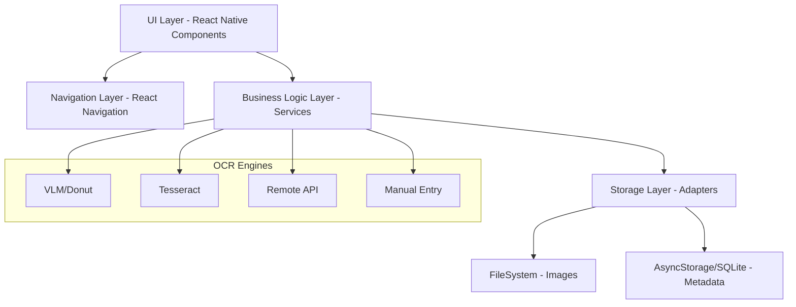
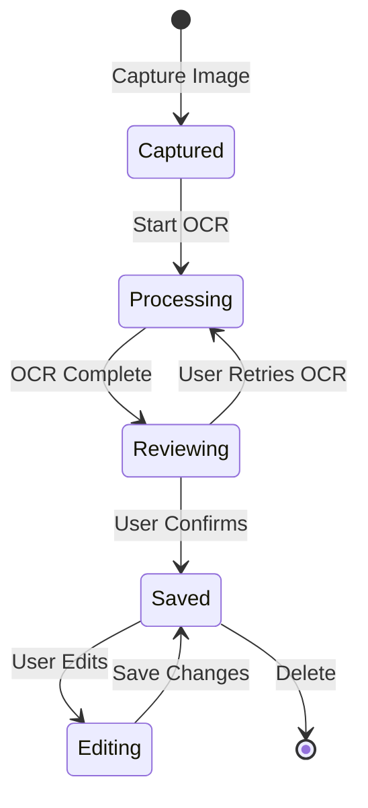

# Design Document

## Overview

Paperkeep is built as a React Native application using Expo, following an offline-first architecture with a modular component structure. The application is organized into distinct layers: presentation (UI components), business logic (services), and data persistence (storage). All data processing occurs on-device, with no external dependencies except for the optional Remote API OCR feature.

The design prioritizes:
- **Privacy**: All data remains on the device
- **Performance**: Efficient image processing and data retrieval
- **Modularity**: Pluggable OCR engines and storage adapters
- **User Experience**: Intuitive navigation and responsive feedback

## Architecture

### High-Level Architecture



### Module Structure

```
src/
├── components/          # Reusable UI components
│   ├── receipts/       # Receipt-specific components
│   ├── common/         # Shared UI elements
│   └── forms/          # Form components
├── screens/            # Screen components
│   ├── HomeScreen/
│   ├── CaptureScreen/
│   ├── DetailScreen/
│   ├── SettingsScreen/
│   └── ExportScreen/
├── navigation/         # Navigation configuration
├── services/           # Business logic
│   ├── ocr/           # OCR engine implementations
│   ├── storage/       # Storage adapters
│   ├── image/         # Image processing
│   └── export/        # Export/import logic
├── types/             # TypeScript type definitions
├── hooks/             # Custom React hooks
├── utils/             # Utility functions
└── constants/         # App constants and config
```

## Components and Interfaces

### Core Data Models

```typescript
// Receipt metadata structure
interface Receipt {
  id: string;                    // UUID
  storeName: string;
  date: Date;
  totalAmount: number;           // In cents
  tags: string[];
  notes?: string;
  ocrText: string;               // Original OCR output
  imageUri: string;              // FileSystem path
  createdAt: Date;
  updatedAt: Date;
}

// OCR result structure
interface OCRResult {
  storeName: string;
  date: Date | null;
  totalAmount: number | null;    // In cents
  lineItems: LineItem[];
  rawText: string;
  confidence: number;            // 0-1
}

interface LineItem {
  description: string;
  amount: number;                // In cents
}

// Settings structure
interface AppSettings {
  ocrEngine: 'vlm' | 'tesseract' | 'remote' | 'manual';
  autoCrop: boolean;
  tesseractLanguage: string;
  remoteApiEndpoint?: string;
  theme: 'light' | 'dark' | 'auto';
}
```

### Storage Layer

**Interface Design:**

```typescript
interface IStorageAdapter {
  // Receipt metadata operations
  saveReceipt(receipt: Receipt): Promise<void>;
  getReceipt(id: string): Promise<Receipt | null>;
  getAllReceipts(): Promise<Receipt[]>;
  updateReceipt(id: string, updates: Partial<Receipt>): Promise<void>;
  deleteReceipt(id: string): Promise<void>;
  
  // Image operations
  saveImage(imageUri: string, receiptId: string): Promise<string>;
  getImage(receiptId: string): Promise<string | null>;
  deleteImage(receiptId: string): Promise<void>;
  
  // Settings operations
  saveSettings(settings: AppSettings): Promise<void>;
  getSettings(): Promise<AppSettings>;
}
```

**Implementation Strategy:**

- **MetadataStorage**: Uses `expo-sqlite` for structured queries and better performance with large datasets
- **ImageStorage**: Uses `expo-file-system` to store images in app's document directory
- **SettingsStorage**: Uses `@react-native-async-storage/async-storage` for simple key-value storage

**Database Schema (SQLite):**

```sql
CREATE TABLE receipts (
  id TEXT PRIMARY KEY,
  store_name TEXT NOT NULL,
  date INTEGER NOT NULL,
  total_amount INTEGER NOT NULL,
  tags TEXT NOT NULL,           -- JSON array
  notes TEXT,
  ocr_text TEXT NOT NULL,
  image_uri TEXT NOT NULL,
  created_at INTEGER NOT NULL,
  updated_at INTEGER NOT NULL
);

CREATE INDEX idx_receipts_date ON receipts(date DESC);
CREATE INDEX idx_receipts_store ON receipts(store_name);
```

### OCR Service

**Interface Design:**

```typescript
interface IOCREngine {
  name: string;
  process(imageUri: string, onProgress?: (progress: number) => void): Promise<OCRResult>;
  isAvailable(): Promise<boolean>;
}

class OCRService {
  private engines: Map<string, IOCREngine>;
  
  registerEngine(name: string, engine: IOCREngine): void;
  async processReceipt(imageUri: string, engineName: string, onProgress?: (progress: number) => void): Promise<OCRResult>;
}
```

**Engine Implementations:**

1. **VLMEngine**: Uses Transformers.js with Donut model
   - Model loaded on first use and cached
   - Runs in background thread to avoid UI blocking
   - Best accuracy for structured receipt data

2. **TesseractEngine**: Uses `react-native-tesseract-ocr`
   - Supports multiple languages
   - Faster than VLM but less accurate for structured data
   - Requires post-processing to extract structured fields

3. **RemoteAPIEngine**: HTTP client for external OCR service
   - Requires network connectivity
   - Configurable endpoint
   - Handles timeout and retry logic

4. **ManualEngine**: Returns empty OCRResult
   - Allows users to skip OCR entirely
   - Presents empty form for manual entry

### Image Processing Service

```typescript
interface IImageProcessor {
  compress(imageUri: string, quality: number): Promise<string>;
  autoCrop(imageUri: string): Promise<string>;
  resize(imageUri: string, maxWidth: number, maxHeight: number): Promise<string>;
}
```

**Implementation:**

- Uses `expo-image-manipulator` for compression, cropping, and resizing
- Auto-crop uses edge detection algorithm (Canny edge detection + contour finding)
- Compression targets 80% quality with max dimension of 1920px
- All operations return new file URIs, original files are cleaned up

### Export/Import Service

```typescript
interface IExportService {
  exportData(): Promise<string>;  // Returns ZIP file URI
  importData(zipUri: string, strategy: 'merge' | 'replace' | 'skip'): Promise<ImportResult>;
}

interface ImportResult {
  success: boolean;
  imported: number;
  skipped: number;
  errors: string[];
}
```

**Implementation:**

- Uses `expo-file-system` to create temporary directory for ZIP operations
- Uses `react-native-zip-archive` for ZIP creation and extraction
- Export format:
  ```
  paperkeep-export-{timestamp}.zip
  ├── metadata.json          # Array of receipts
  └── images/
      ├── {receipt-id-1}.jpg
      ├── {receipt-id-2}.jpg
      └── ...
  ```
- Import validates JSON schema before applying changes
- Conflict resolution prompts user for each conflicting receipt

## Data Models

### Receipt Lifecycle



### Tag Management

- Tags stored as normalized lowercase strings
- Tag suggestions generated from existing receipts using frequency analysis
- Maximum 10 tags per receipt
- Tag autocomplete with fuzzy matching

### Search and Filter Logic

**Search Implementation:**

```typescript
interface SearchCriteria {
  query?: string;              // Searches store name and notes
  tags?: string[];             // AND logic for multiple tags
  dateFrom?: Date;
  dateTo?: Date;
  minAmount?: number;          // In cents
  maxAmount?: number;          // In cents
}

function searchReceipts(receipts: Receipt[], criteria: SearchCriteria): Receipt[] {
  return receipts.filter(receipt => {
    // Text search
    if (criteria.query) {
      const searchText = `${receipt.storeName} ${receipt.notes || ''}`.toLowerCase();
      if (!searchText.includes(criteria.query.toLowerCase())) return false;
    }
    
    // Tag filter (AND logic)
    if (criteria.tags && criteria.tags.length > 0) {
      if (!criteria.tags.every(tag => receipt.tags.includes(tag))) return false;
    }
    
    // Date range
    if (criteria.dateFrom && receipt.date < criteria.dateFrom) return false;
    if (criteria.dateTo && receipt.date > criteria.dateTo) return false;
    
    // Amount range
    if (criteria.minAmount && receipt.totalAmount < criteria.minAmount) return false;
    if (criteria.maxAmount && receipt.totalAmount > criteria.maxAmount) return false;
    
    return true;
  });
}
```

## Error Handling

### Error Categories

1. **Storage Errors**
   - Insufficient storage space
   - Permission denied
   - Database corruption
   - File system errors

2. **OCR Errors**
   - Model loading failure
   - Processing timeout
   - Network errors (Remote API)
   - Invalid image format

3. **Camera/Image Errors**
   - Permission denied
   - Camera unavailable
   - Invalid image file
   - Image processing failure

4. **Import/Export Errors**
   - Invalid ZIP structure
   - Corrupted data
   - Insufficient storage
   - Permission errors

### Error Handling Strategy

```typescript
class AppError extends Error {
  constructor(
    message: string,
    public code: string,
    public category: 'storage' | 'ocr' | 'camera' | 'import' | 'network',
    public recoverable: boolean,
    public userMessage: string
  ) {
    super(message);
  }
}

// Error boundary for React components
class ErrorBoundary extends React.Component {
  // Catches rendering errors and displays fallback UI
}

// Global error handler for async operations
function handleError(error: AppError): void {
  // Log error for debugging
  console.error(error);
  
  // Show user-friendly message
  Alert.alert(
    'Error',
    error.userMessage,
    error.recoverable ? [
      { text: 'Cancel', style: 'cancel' },
      { text: 'Retry', onPress: () => retryOperation() }
    ] : [
      { text: 'OK' }
    ]
  );
}
```

### Retry Logic

- OCR processing: 2 retries with exponential backoff
- Network requests: 3 retries with 1s, 2s, 4s delays
- Storage operations: No automatic retry, prompt user
- Image operations: 1 retry, then fallback to original

## Testing Strategy

### Unit Testing

**Target Coverage: Core business logic and utilities**

```typescript
// Example test structure
describe('OCRService', () => {
  describe('processReceipt', () => {
    it('should extract store name from receipt image');
    it('should parse date in multiple formats');
    it('should convert amounts to cents correctly');
    it('should handle OCR engine failures gracefully');
  });
});

describe('StorageAdapter', () => {
  it('should save and retrieve receipts');
  it('should handle concurrent writes');
  it('should maintain data integrity on errors');
});

describe('SearchService', () => {
  it('should filter by multiple tags with AND logic');
  it('should search case-insensitively');
  it('should handle date range queries');
});
```

**Testing Tools:**
- Jest for test runner
- React Native Testing Library for component testing
- Mock implementations for storage and OCR engines

### Integration Testing

**Focus Areas:**

1. **Receipt Capture Flow**
   - Camera → Image Processing → OCR → Save
   - File Upload → Image Processing → OCR → Save

2. **Data Persistence**
   - Save receipt → Close app → Reopen → Verify data
   - Edit receipt → Verify changes persist

3. **Export/Import**
   - Export data → Import on fresh install → Verify integrity

4. **Search and Filter**
   - Create receipts with various attributes → Apply filters → Verify results

### Manual Testing Checklist

- [ ] Camera permissions on first launch
- [ ] Image capture and auto-crop accuracy
- [ ] OCR accuracy across different receipt types
- [ ] UI responsiveness with 100+ receipts
- [ ] Dark mode appearance
- [ ] Offline functionality (airplane mode)
- [ ] Export/import with large datasets
- [ ] Memory usage during image processing
- [ ] App behavior on low storage
- [ ] Navigation and back button behavior

### Performance Testing

**Metrics to Monitor:**

- Image compression time (target: < 2s)
- OCR processing time (target: < 10s)
- Receipt list rendering (target: 60fps with 100+ items)
- Search query response (target: < 1s)
- App launch time (target: < 3s)
- Memory usage during OCR (target: < 200MB)

**Testing Approach:**

- Use React Native Performance Monitor
- Profile with Xcode Instruments / Android Profiler
- Test with datasets of 10, 100, 1000 receipts
- Monitor memory leaks during image operations

## UI/UX Design Specifications

### Design System

**Colors:**

```typescript
const colors = {
  light: {
    background: '#FEFCF8',
    primary: '#6B7F5A',
    accent: '#D4A574',
    text: '#2C2C2C',
    textSecondary: '#6B6B6B',
    border: '#E5E5E5',
    card: '#FFFFFF',
    error: '#D64545',
    success: '#5A7F6B',
  },
  dark: {
    background: '#1A1A1A',
    primary: '#8FA87A',
    accent: '#E5B885',
    text: '#F5F5F5',
    textSecondary: '#A0A0A0',
    border: '#3A3A3A',
    card: '#2A2A2A',
    error: '#E55555',
    success: '#7A8F7F',
  }
};
```

**Typography:**

```typescript
const typography = {
  fonts: {
    ui: 'Inter',
    mono: 'JetBrains Mono',
  },
  sizes: {
    xs: 12,
    sm: 14,
    base: 16,
    lg: 18,
    xl: 20,
    '2xl': 24,
    '3xl': 30,
  },
  weights: {
    normal: '400',
    medium: '500',
    semibold: '600',
    bold: '700',
  }
};
```

**Spacing:**

```typescript
const spacing = {
  xs: 4,
  sm: 8,
  md: 16,
  lg: 24,
  xl: 32,
  '2xl': 48,
};
```

**Shadows:**

```typescript
const shadows = {
  sm: {
    shadowColor: '#000',
    shadowOffset: { width: 0, height: 1 },
    shadowOpacity: 0.05,
    shadowRadius: 2,
    elevation: 1,
  },
  md: {
    shadowColor: '#000',
    shadowOffset: { width: 0, height: 2 },
    shadowOpacity: 0.08,
    shadowRadius: 4,
    elevation: 3,
  },
  lg: {
    shadowColor: '#000',
    shadowOffset: { width: 0, height: 4 },
    shadowOpacity: 0.12,
    shadowRadius: 8,
    elevation: 5,
  }
};
```

### Screen Layouts

**HomeScreen (Receipt List):**

- Header with search icon and filter button
- Masonry grid (2 columns) using `react-native-masonry-list`
- Each card shows: thumbnail, store name, date, amount, tags (max 3 visible)
- Pull-to-refresh functionality
- Floating action button for capture
- Empty state with illustration and "Add Receipt" CTA

**CaptureScreen:**

- Full-screen camera view
- Capture button (center bottom)
- Gallery button (bottom left)
- Flash toggle (top right)
- Auto-crop toggle (top left)
- Preview overlay showing detected edges when auto-crop enabled

**DetailScreen:**

- Full-width receipt image at top (zoomable)
- Scrollable content below with:
  - Store name (editable)
  - Date picker
  - Amount input (formatted as currency)
  - Tags (chip input with suggestions)
  - Notes (multiline text input)
  - OCR text (collapsible, read-only)
- Edit/Save button in header
- Delete button (destructive action)

**SettingsScreen:**

- Grouped list layout
- OCR Engine section (radio buttons)
- Image Processing section (auto-crop toggle)
- Engine-specific settings (conditional rendering)
- Theme selection
- About section (version, licenses)
- Reset to defaults button

**ExportScreen:**

- Export button with icon
- Last export date/time
- Import button
- Storage usage indicator
- Receipt count display

### Navigation Structure

```typescript
// Bottom Tab Navigator
<Tab.Navigator>
  <Tab.Screen name="Home" component={HomeScreen} />
  <Tab.Screen name="Capture" component={CaptureScreen} />
  <Tab.Screen name="Settings" component={SettingsScreen} />
</Tab.Navigator>

// Stack Navigator (for modals and details)
<Stack.Navigator>
  <Stack.Screen name="Main" component={TabNavigator} />
  <Stack.Screen name="Detail" component={DetailScreen} options={{ presentation: 'modal' }} />
  <Stack.Screen name="Export" component={ExportScreen} />
</Stack.Navigator>
```

### Animations and Interactions

- Card press: Scale down to 0.98 with 150ms duration
- Swipe to delete: Reveal red background with trash icon
- Pull to refresh: Custom spinner with brand colors
- OCR progress: Animated progress bar with percentage
- Image zoom: Pinch gesture with smooth spring animation
- Screen transitions: Slide from right (iOS) / Fade (Android)
- Tag chip add: Scale in animation
- Success feedback: Haptic feedback + checkmark animation

## Security and Privacy Considerations

### Data Protection

- All data stored in app's sandboxed directory
- No analytics or tracking
- No network requests except optional Remote API OCR
- Images never uploaded to external services (except Remote API if enabled)
- No user authentication required (single-user app)

### Permissions

Required permissions:
- Camera (for receipt capture)
- Photo Library (for file upload)
- File System (for export/import)

Permission handling:
- Request permissions just-in-time
- Explain permission purpose before requesting
- Graceful degradation if permissions denied
- Settings deep-link if permissions permanently denied

### Data Retention

- No automatic data deletion
- User controls all data through export/delete
- Clear data option in settings (with confirmation)
- Uninstall removes all app data automatically

## Performance Optimizations

### Image Handling

- Compress images to max 1920px dimension
- Use JPEG format with 80% quality
- Lazy load images in receipt list (thumbnail generation)
- Cache processed images to avoid reprocessing
- Clean up temporary files after operations

### List Rendering

- Use `FlatList` with `windowSize` optimization
- Implement `getItemLayout` for consistent item heights
- Use `React.memo` for receipt cards
- Virtualize off-screen items
- Debounce search input (300ms)

### Database Queries

- Index frequently queried columns (date, store_name)
- Limit initial query to 50 most recent receipts
- Implement pagination for large datasets
- Use prepared statements for repeated queries
- Batch insert operations during import

### Memory Management

- Release OCR model from memory when not in use
- Limit concurrent image processing operations
- Use image caching with size limits
- Clean up event listeners on unmount
- Monitor memory usage in development

## Accessibility

- All interactive elements have accessible labels
- Minimum touch target size: 44x44 points
- Support for screen readers (VoiceOver/TalkBack)
- Sufficient color contrast ratios (WCAG AA)
- Text scaling support
- Keyboard navigation where applicable
- Alternative text for images
- Error messages announced to screen readers

## Future Considerations

### Potential Enhancements

- Multi-currency support
- Receipt categories (business, personal, etc.)
- Budget tracking and analytics
- Recurring receipt detection
- Cloud backup option (encrypted)
- Shared receipt collections
- Receipt splitting for group expenses
- Tax category tagging
- Export to accounting software formats

### Technical Debt to Monitor

- SQLite migration strategy for schema changes
- OCR model updates and versioning
- Dependency updates (especially Expo SDK)
- Performance with 10,000+ receipts
- Storage optimization for large image collections
